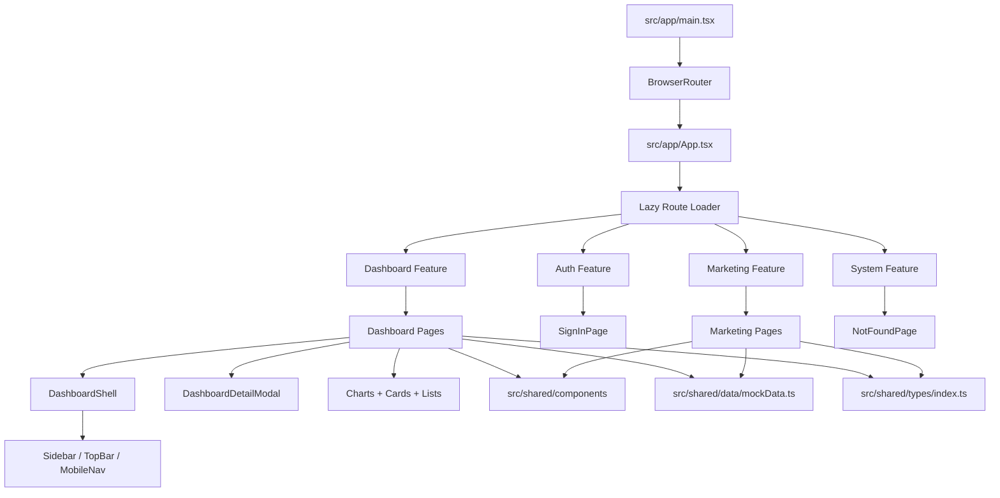
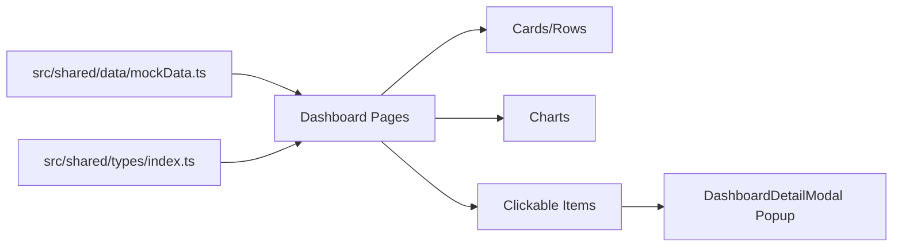

# Student AI

Student AI is a React + TypeScript web app with two product surfaces:
1. Marketing/public website (`/`, `/features`, `/pricing`, etc.)
2. Student dashboard (`/dashboard/*`) for courses, quizzes, flashcards, planner, assignments, study rooms, analytics, profile, and settings

## Tech Stack

- React 19
- TypeScript 5
- Vite 7
- React Router 7
- Tailwind CSS 3
- Recharts
- Lucide React
- ESLint 9

## Quick Start

```bash
npm install
npm run dev
```

Open `http://localhost:5173`.

## Scripts

```bash
npm run dev      # Start dev server
npm run build    # Type-check and build production bundle
npm run preview  # Preview production build
npm run lint     # Run lint checks
```

## Architecture Graph



## Route Map

### Marketing/Public
- `/`
- `/features`
- `/how-it-works`
- `/about`
- `/blog`
- `/contact`
- `/faq`
- `/help`
- `/privacy`
- `/terms`
- `/pricing`

### Auth
- `/signin`

### Dashboard
- `/dashboard`
- `/dashboard/courses`
- `/dashboard/flashcards`
- `/dashboard/quizzes`
- `/dashboard/planner`
- `/dashboard/assignments`
- `/dashboard/study-room`
- `/dashboard/messages`
- `/dashboard/messages/thread/:threadId`
- `/dashboard/messages/quick-reply/:threadId`
- `/dashboard/analytics`
- `/dashboard/billing`
- `/dashboard/settings`
- `/dashboard/profile`

### Utility
- `/app` -> redirects to `/dashboard`
- `*` -> `NotFoundPage`

## Folder Structure

```text
student-ai/
|-- public/
|-- src/
|   |-- app/
|   |   |-- App.tsx
|   |   |-- main.tsx
|   |   `-- index.css
|   |-- features/
|   |   |-- auth/
|   |   |   `-- pages/
|   |   |-- dashboard/
|   |   |   |-- components/
|   |   |   `-- pages/
|   |   |-- marketing/
|   |   |   |-- components/
|   |   |   `-- pages/
|   |   `-- system/
|   |       `-- pages/
|   |-- shared/
|   |   |-- components/
|   |   |   |-- common/
|   |   |   |-- layout/
|   |   |   `-- settings/
|   |   |-- data/
|   |   |-- hooks/
|   |   `-- types/
|   `-- data/                      # legacy folder (not part of active app include)
|-- dist/
|-- index.html
|-- package.json
|-- tailwind.config.js
|-- tsconfig.app.json
`-- vite.config.ts
```

## Active Import Aliases

Configured in `tsconfig.app.json`:
- `@app/*` -> `src/app/*`
- `@features/*` -> `src/features/*`
- `@shared/*` -> `src/shared/*`

## Dashboard Data + UI Model



## Key Dashboard Features

- 4-column card grids for core learning modules (courses, quizzes, flashcards, planner, assignments on large screens)
- Click-to-open detail popups with metadata, actions, and full contextual explanation
- Messages experience with thread page and quick reply page
- Profile page with overview, goals, achievements, connected services, and active sessions
- Study Room page with:
  - room status filters
  - live/upcoming/member stats
  - rich room cards
  - popup details (goals, resources, etiquette, host, level, schedule)

## Build Notes

- `npm run build` runs:
  1. TypeScript project build (`tsc -b`)
  2. Vite production bundling
- Output is generated in `dist/`.

## Development Notes

- Routes are lazy loaded in `src/app/App.tsx`.
- Core shared app data is currently mock-driven from `src/shared/data/mockData.ts`.
- Active TypeScript app include paths are constrained to:
  - `src/app`
  - `src/features`
  - `src/shared`
